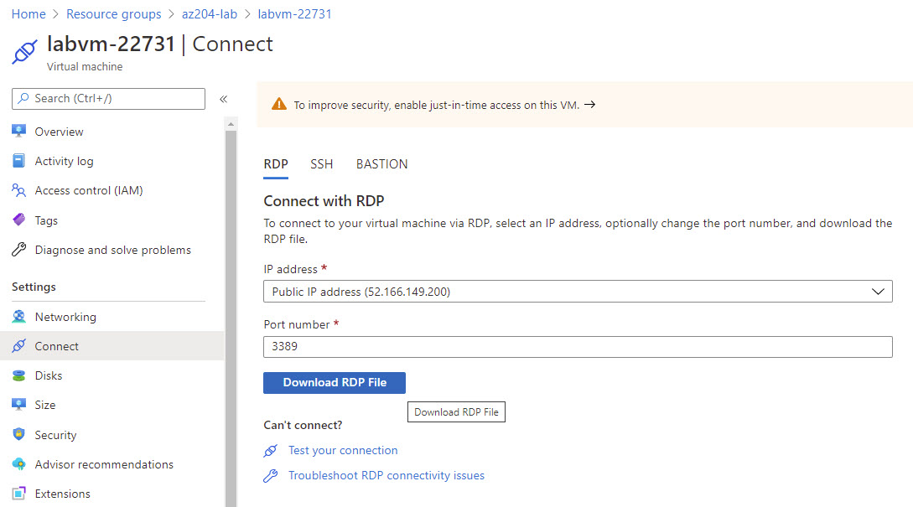
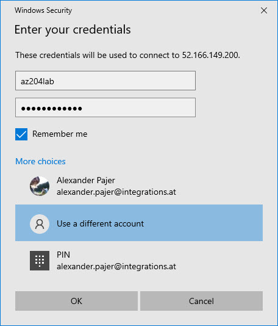

# MS-600 Class Setup Guide

Two options:

-   Use your own PC and install the required Software using: `setup-ms-600.ps1`
-   Use an Azure hosted VM to avoid company restrictions and prox issue

## Required Cloud Ressources

-   [Github User Account](https://github.com/)
-   [Microsoft 365 Developer Tenant](https://developer.microsoft.com/en-us/microsoft-365/dev-program)
-   [Azure DevOps Account](https://dev.azure.com/)
-   Azure Subscription:
    -   Using [Azure Passes](https://www.microsoftazurepass.com/)
    -   Azure Paid / Sponsored Subscription
    -   [Azure Trial Subscription](https://azure.microsoft.com/en-us/free/)

## Create Azure hosted VM

Script `create-lab-vm.azcli`:

```bash
rnd=$RANDOM
loc=westeurope
grp=az-lab
vmname=labvm-$rnd
user=azlabadmin
pwd=Lab@dmin1233

az group create -n $grp -l $loc

az vm create -g $grp -n $vmname --admin-username $user --admin-password $pwd --image  MicrosoftWindowsDesktop:Windows-10:20h1-pro-g2:19041.928.2104091205 --size Standard_E2s_v3
```

> Note: You could also execute `create-lab-vm.sh` or run the following remote script in Cloud Shell

```bash
curl https://raw.githubusercontent.com/arambazamba/class-setup/master/classes/ms-600/create-lab-vm.sh | bash
```


## Connect to VM

Go to Ressource Group `az-lab` and connect to VM using RDP and the credentials that you have used in the script:

Download RDP File:



Optional - Disable Login:


Sign In & Remember:


Credentials:

```
user=azlabadmin
pwd=Lab@dmin1234
```



Accept Settings:


## Install Software

To install Software run the script `setup-ms-600.ps1` from an elevated PowerShell prompt:


```powershell
Set-ExecutionPolicy Bypass -Scope Process -Force;
Invoke-Expression ((New-Object System.Net.WebClient).DownloadString('https://raw.githubusercontent.com/ARambazamba/ms-600/master/Setup/setup-ms-600.ps1'))
```

> Note: This script will run for approx 20 min. No need to wait! In the meantime you can continue to fork and clone my repo as described in the next section.

Congratulations you have completed the base setup of a labs vm!

---
