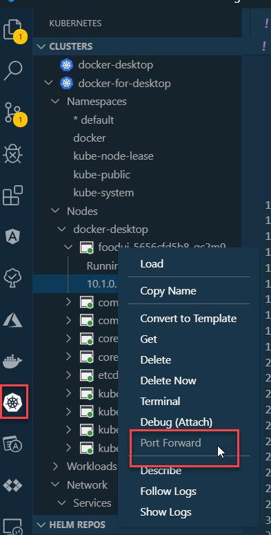

# Docker & Kubernetes Advanced Test

## Docker

Build und Run Local Docker Image:

```
cd ContainerTest
docker build --rm -f "dockerfile" -t containertest .
docker run -it --rm -p 5051:80 containertest
```

Open Browser on URL:

```
http://localhost:5051
```

If you see this the test passed:


## Kubernetes

Go to the folder where `containertest.yaml` is located:

Create a Deployment:

```
kubectl create deployment containertest --image arambazamba/containertest
```

Expose using a Service:

```
kubectl expose deployment containertest --type=LoadBalancer --port=8080
```

Forward the port to Service



> Note: Can also be done using: `kubectl port-forward pods/containertest-5656cfd5b8-gc2m9 8060:80 -n default`

Cleanup:

```
kubectl delete service containertest
kubectl delete deployment containertest
```
