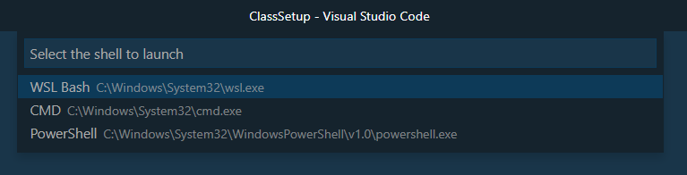

# Visual Studio Code

## VS Code Setup

[Download & Install Visual Studio Code](https://code.visualstudio.com/)

## VS Code Tips & Tricks

[VS Code Tips & Tricks](https://github.com/Microsoft/vscode-tips-and-tricks)

[Useful VS Code Keyboard Shortcuts](https://zellwk.com/blog/useful-vscode-keyboard-shortcuts/)

## Manage VS Code Extensions & Settings using PowerShell

Got to folder `'./code'`

Import from my prefered extensions:

Execute `importExtensions.ps1`:

```
foreach($line in Get-Content ".\extensions.txt") {
    code --install-extension $line
}
```

Dump current installed Extensions:

Execute `dumpExtensions.ps1`:

```
code --list-extensions > ".\extensions.txt"
```

>Note: Further VS Code Command Line Documentation can be found [here](https://code.visualstudio.com/docs/editor/command-line)

## Launche Shell of your Choice

Install [Shell Launcher VS Code Extension](https://marketplace.visualstudio.com/items?itemName=Tyriar.shell-launcher)

Add Shell Launcher Config to `settings.json`:

```
"shellLauncher.shells.windows": [
  {
    "shell": "C:\\Windows\\System32\\wsl.exe",
    "label": "WSL Bash"
  },
  {
    "shell": "C:\\Windows\\System32\\cmd.exe",
    "label": "CMD"
  },
  {
    "shell": "C:\\Windows\\System32\\WindowsPowerShell\\v1.0\\powershell.exe",
    "label": "PowerShell"
  }
]
```

Add Keybinding of your choice to `keybindings.json`:

```
{
  "key": "ctrl+shift+numpad_subtract",
  "command": "shellLauncher.launch"
}
```

Using `ctrl+shift+numpad_subtract`:



## VS Code Settings used for class delivery

Copy settings.json & keybindings.json to `%APPDATA%\Code\User\`

### settings.json:

```
{
  "workbench.startupEditor": "none",
  "terminal.integrated.shell.windows": "C:\\WINDOWS\\System32\\WindowsPowerShell\\v1.0\\powershell.exe",
  "git.enableSmartCommit": true,
  "window.zoomLevel": 1,
  "problems.autoReveal": false,
  "workbench.editor.enablePreview": false,
  "window.restoreWindows": "none",
  "files.hotExit": "off",
  "editor.wordWrap": "on",
  "editor.minimap.enabled": false,
  "problems.decorations.enabled": false,
  "explorer.confirmDelete": false,
  "explorer.confirmDragAndDrop": false,
  "explorer.openEditors.visible": 0,
  "typescript.updateImportsOnFileMove.enabled": "always",
  "emmet.triggerExpansionOnTab": true,
  "workbench.editor.restoreViewState": false,
  "workbench.colorTheme": "Cobalt2",
  "workbench.colorCustomizations": {
    "terminal.background":"#556368",
    "terminal.foreground":"#d89134",
    "terminalCursor.background":"#A89984",
    "terminalCursor.foreground":"#A89984",
    "terminal.ansiBlack":"#1D2021",
    "terminal.ansiBlue":"#0D6678",
    "terminal.ansiBrightBlack":"#665C54",
    "terminal.ansiBrightBlue":"#0D6678",
    "terminal.ansiBrightCyan":"#8BA59B",
    "terminal.ansiBrightGreen":"#95C085",
    "terminal.ansiBrightMagenta":"#8F4673",
    "terminal.ansiBrightRed":"#FB543F",
    "terminal.ansiBrightWhite":"#FDF4C1",
    "terminal.ansiBrightYellow":"#FAC03B",
    "terminal.ansiCyan":"#8BA59B",
    "terminal.ansiGreen":"#95C085",
    "terminal.ansiMagenta":"#8F4673",
    "terminal.ansiRed":"#FB543F",
    "terminal.ansiWhite":"#A89984",
    "terminal.ansiYellow":"#FAC03B"
  },
  "liveServer.settings.donotShowInfoMsg": true,
  "bracket-pair-colorizer-2.colors": ["Red", "yellow", "Green", "Pink"],
  "csharp.format.enable": true,
  "csharpfixformat.sort.usings.enabled": true,
  "terminal.integrated.cursorBlinking": true,
  "terminal.integrated.cursorStyle": "line",
  "todohighlight.isCaseSensitive": false,
  "todohighlight.keywords": [
    {
      "text": "todo:",
      "color": "red",
      "border": "1px solid red",
      "borderRadius": "2px",
      "backgroundColor": "rgba(0,0,0,.2)"
    }
  ],
  "diffEditor.ignoreTrimWhitespace": false,
  "git.confirmSync": false,
  "git-graph.fetchAvatars": true,
  "git.autofetchPeriod": 90,
  "git.autofetch": true,
  "todo-tree.tree.showScanModeButton": false,
  "codespaces.accountProvider": "Microsoft",
  "shellLauncher.shells.windows": [
    {
      "shell": "C:\\Windows\\System32\\wsl.exe",
      "label": "WSL Bash"
    },
    {
      "shell": "C:\\Windows\\System32\\cmd.exe",
      "label": "CMD"
    },
    {
      "shell": "C:\\Windows\\System32\\WindowsPowerShell\\v1.0\\powershell.exe",
      "label": "PowerShell"
    }
  ]
}
```

### keybindings.json:

```
[
  // Save all
  {
    "key": "ctrl+s",
    "command": "workbench.action.files.saveAll"
  },
  // Stage current file
  {
    "key": "alt+s",
    "command": "git.stage"
  },
  // Delete line
  {
    "key": "ctrl+l",
    "command": "editor.action.deleteLines",
    "when": "textInputFocus && !editorReadonly"
  },
  //Open Terminal of Type using Shell Launcher Extension
  {
    "key": "ctrl+shift+numpad_subtract",
    "command": "shellLauncher.launch"
  }
]
```
