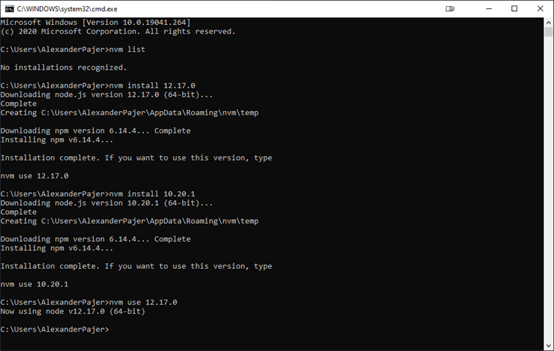

# Node.js

Although you could just simply download [Node.js](https://nodejs.org/en/) I recommend using [Node Version Manager for Windows](https://github.com/coreybutler/nvm-windows) written by Corey Butler because it alows switching the Node version.

[Download and Install Node Version Manager](https://github.com/coreybutler/nvm-windows/releases)

Go to Console:

```
nvm list
nvm install 12.17.0
nvm install 10.20.1
```

> Note: A full list of Node Versions can be found [here](https://nodejs.org/en/download/releases/)

Switch to a certain Node Version:

```
nvm use 12.17.0
```


