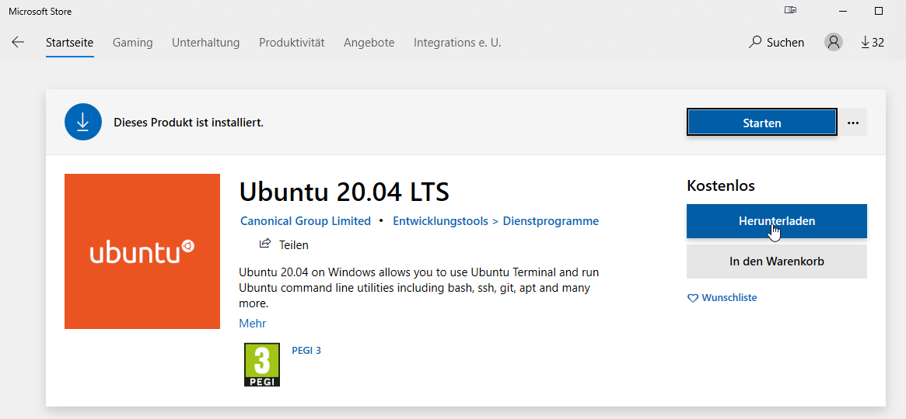
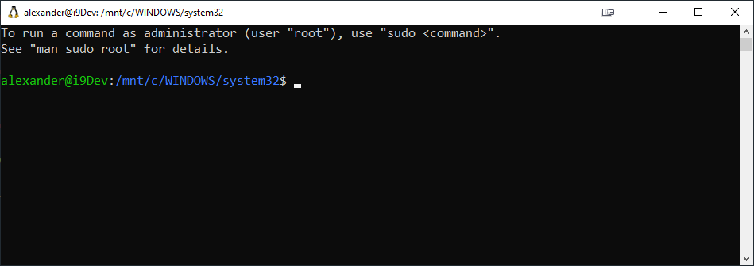
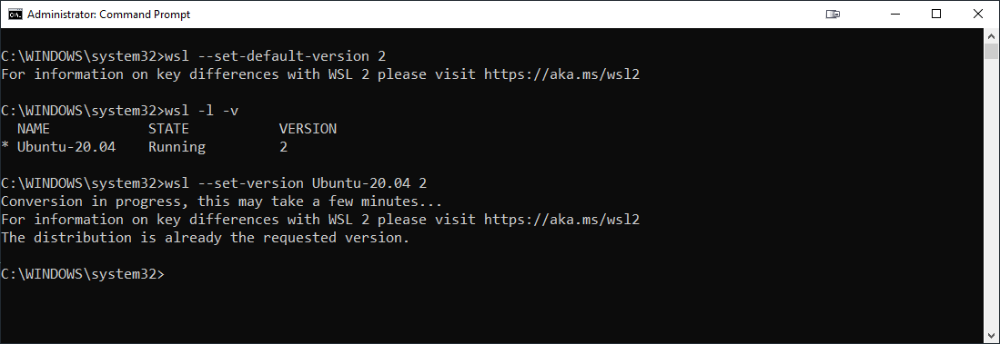

# Windows Subsystem Linux 2 (WSL2)

Requires Windows 10 - May 2020 Update or higher

Enable the Windows Subsystem for Linux:

```
Enable-WindowsOptionalFeature -Online -FeatureName Microsoft-Windows-Subsystem-Linux
```

Enable the Virtual Machine Platform feature:

```
Enable-WindowsOptionalFeature -Online -FeatureName VirtualMachinePlatform
```

Install Updated Linux-Kernel:

[Download the Linux Kernel Update Package](https://docs.microsoft.com/en-us/windows/wsl/wsl2-kernel)

Set WSL to Version 2:

```
wsl --set-default-version 2
```

Install a Linux Disto from Microsoft Store:



Set Username & Password:



Set WSL to use your default Disto

```
wsl -l -v
wsl --set-version DistroName 2
```


